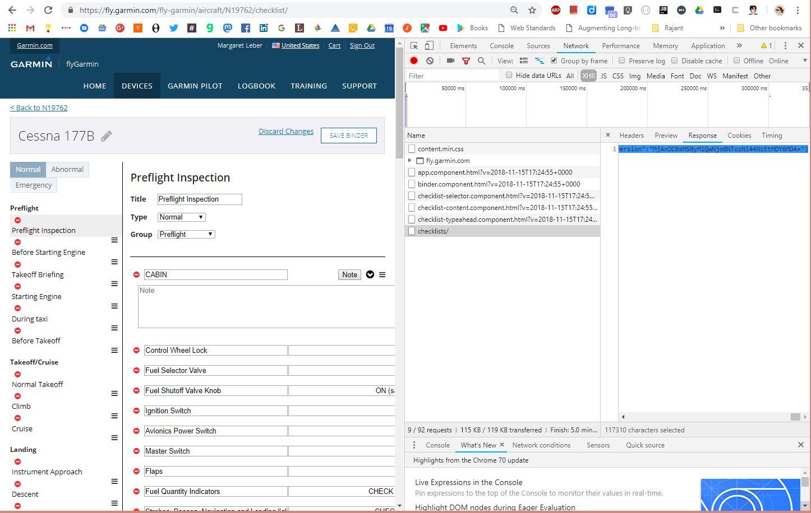
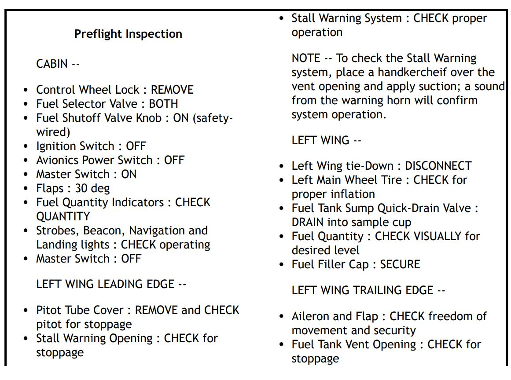
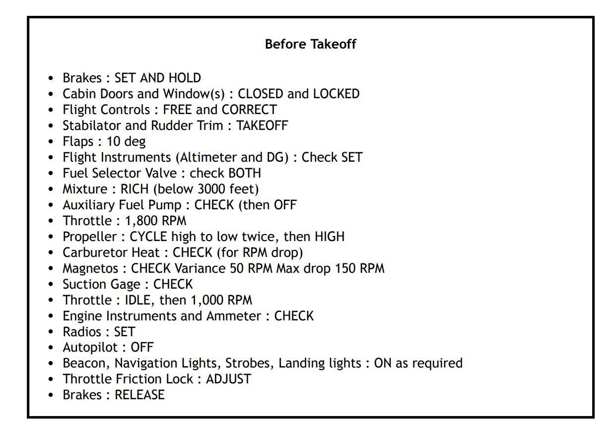
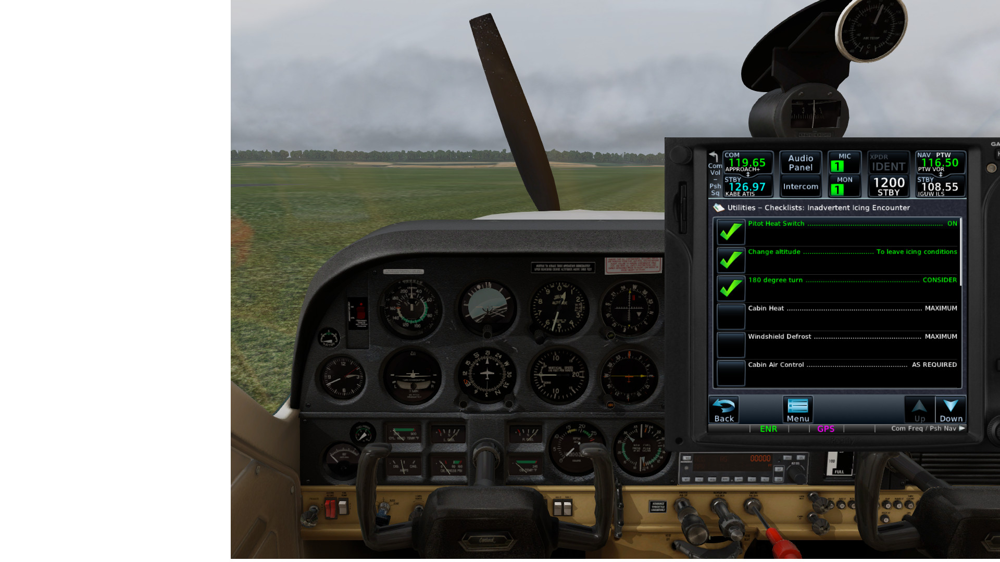
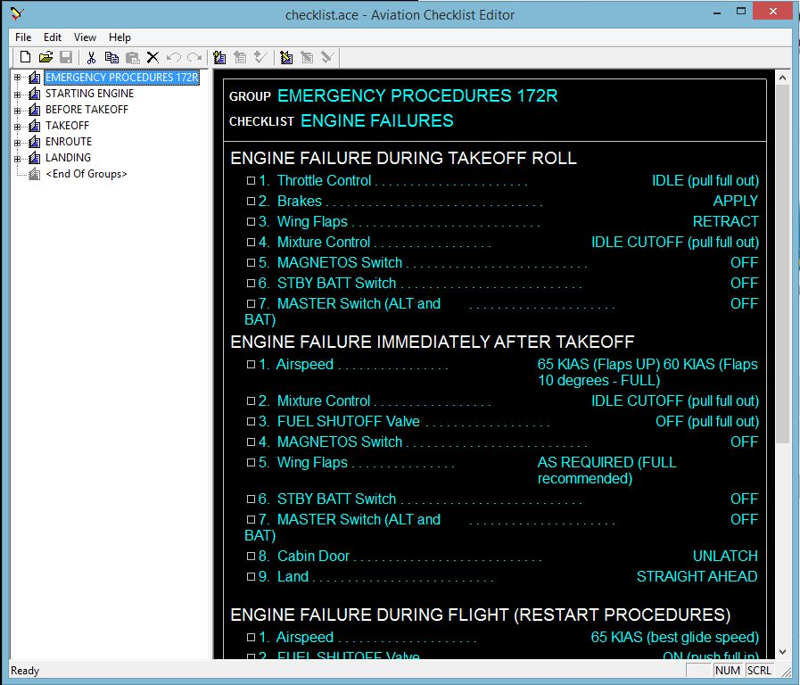
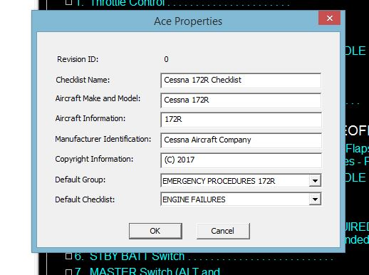
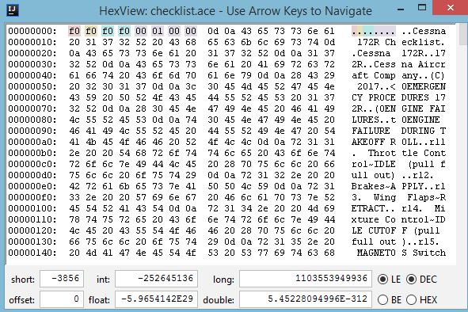

# checklist

(warning: personal toy program; not even alpha quality yet)

renders Garmin Pilot checklists in two formats:

* HTML suitable for printing
* [Garmin ACE format](https://www8.garmin.com/support/download_details.jsp?id=5075)

Using:

http://json4s.org/

http://www.lihaoyi.com/scalatags/#ScalaTags

## Getting the input from FlyGarmin 

Go to FlyGarmin and grab the JSON payload off your checklist edit page. 
I currently use Chrome DevTools:  

https://fly.garmin.com/fly-garmin/aircraft/N19762/checklist/

Use your tail number of course...

Paste that into `src/main/resources/checklist.json` and run the program.
This will write `
* `htmlChecklist.html`
* `C177checklist.ace` and
* `hackedminimal.ace` (a test ACE exemplar)

to the project directory.

## HTML format

I load this in a browser then print it to a PDF on A5 paper in landscape mode to fit on a kneeboard.
CSS could probably be tweeked better. 

## Garmin ACE format
I'm reverse-engineering the undocumented Garmin ACE format. See the source for details.

Working in [_Reality XP GTN 750/650 Touch_](http://www.reality-xp.com) on  [XPlane 11](https://www.x-plane.com/)

