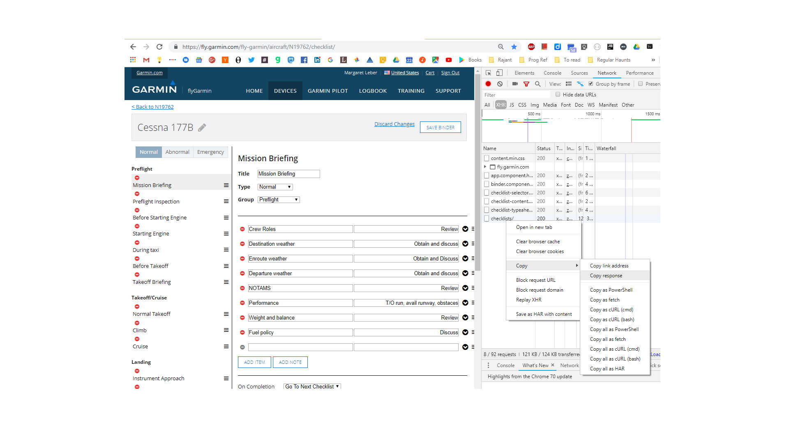

# checklist

(warning: personal toy program; not even alpha quality yet)

renders Garmin Pilot checklists in two formats:

* HTML suitable for printing
* [Garmin ACE format](https://www8.garmin.com/support/download_details.jsp?id=5075)

Using:

http://json4s.org/

http://www.lihaoyi.com/scalatags/#ScalaTags

The input: go to FlyGarmin and grab a JSON payload off their checklist edit page:

## Garmin ACE format
I'm reverse-engineering the undocumented Garmin ACE format. See the source for details.

