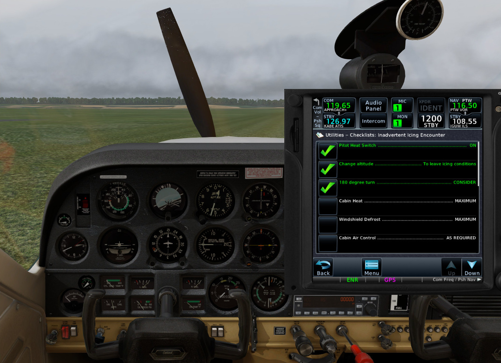

# checklist

(warning: personal toy program; not even alpha quality yet)

renders Garmin Pilot checklists in two formats:

* HTML suitable for printing
* [Garmin ACE format](https://www8.garmin.com/support/download_details.jsp?id=5075)

Using:

http://json4s.org/

http://www.lihaoyi.com/scalatags/#ScalaTags

The input: go to FlyGarmin and grab a JSON payload off their checklist edit page:

## HTML format

I load this in a browser then print it to a PDF on A5 paper in landscape mode to fit on a kneeboard.
CSS could probably be tweeked better. 

## Garmin ACE format
I'm reverse-engineering the undocumented Garmin ACE format. See the source for details.

Working in [_Reality XP GTN 750/650 Touch_](http://www.reality-xp.com) on  [XPlane 11](https://www.x-plane.com/)

